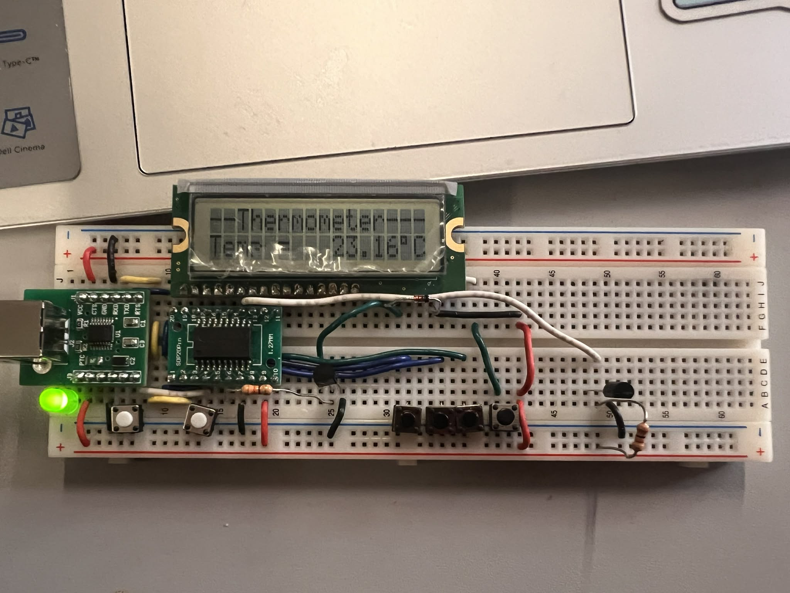
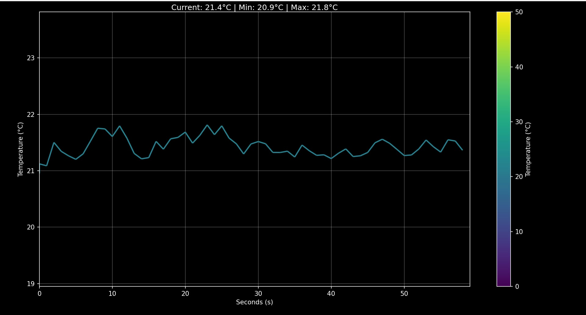
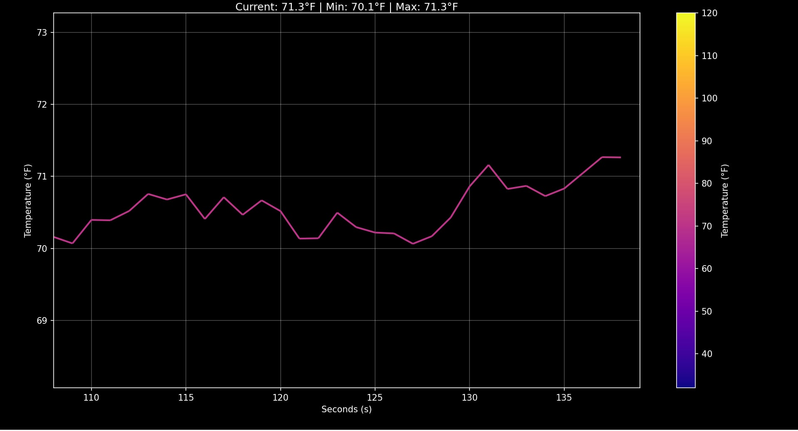

# Digital Thermometer
## Overview

This project is a microcontroller-based digital thermometer designed to measure and display ambient temperature using an analog temperature sensor and on-chip analog-to-digital conversion (ADC). The system converts sensor voltage into temperature readings through firmware-level processing and calibration. 
The thermometer firmware is implemented on an 8051-based microcontroller (N76E003) and demonstrates efficient use of ADCs, timers, and serial communication for real-time data acquisition and visualization. Measured temperature values are processed, scaled, and transmitted or displayed with minimal latency.

## Features

* Real-time temperature measurement

* Analog temperature sensing

* ADC-based data acquisition

* Firmware-level calibration and unit conversion

* Serial output for monitoring and visualization
* Python-based strip chart with Celsius and Fahrenheit degress

## Technologies Used

* N76E003 (8051-based microcontroller)

* LM335 temperature sensor

* Analog-to-digital converter (ADC)

* Language: Assembly, Python

* Serial communication (UART)
